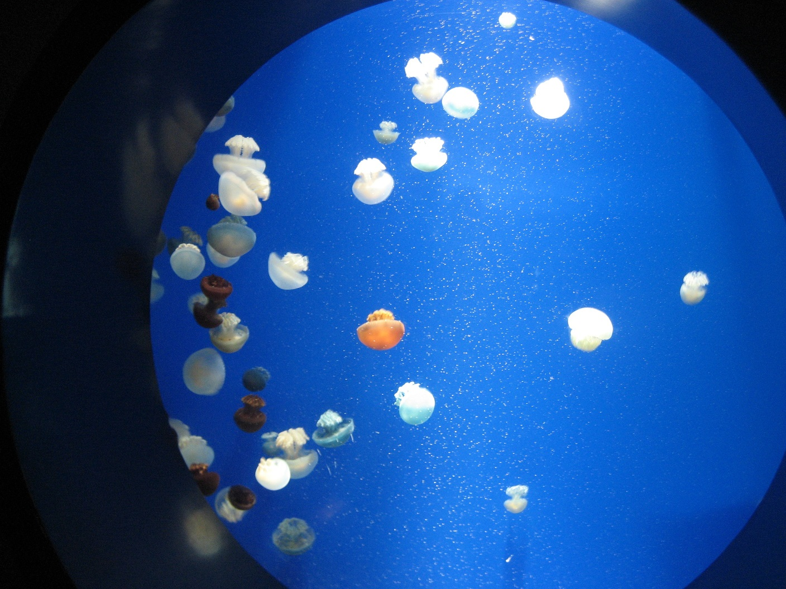

<!DOCTYPE html>
<html lang="ja">

<head>

  <meta charset="UTF-8">
  <meta name="viewport" content="width=device-width, initial-scale=1.0, maximum-scale=1.0, minimum-scale=1.0">
  <title>Portforio_practice_jquery</title>
  <link rel="stylesheet" href="vegas.min.css" />
  
 
  <link href="style111.css" rel="stylesheet">
<link rel="stylesheet" href="https://maxcdn.bootstrapcdn.com/bootstrap/4.0.0/css/bootstrap.min.css" integrity="sha384-Gn5384xqQ1aoWXA+058RXPxPg6fy4IWvTNh0E263XmFcJlSAwiGgFAW/dAiS6JXm" crossorigin="anonymous">

  
   

  <link rel="stylesheet" href="css/animate.min.css" />
  

  <link rel="stylesheet" href="https://use.fontawesome.com/releases/v5.1.0/css/all.css" integrity="sha384-lKuwvrZot6UHsBSfcMvOkWwlCMgc0TaWr+30HWe3a4ltaBwTZhyTEggF5tJv8tbt" crossorigin="anonymous">
   
   <link rel="stylesheet" href="https://stackpath.bootstrapcdn.com/font-awesome/4.7.0/css/font-awesome.min.css">
   

  

</head>

<body>

<h1>ホームページ制作から運営まで サポートします！</h1>

ブログ対応ページ（Wordpress対応） かつご要望に応じてAPIも追加対応 お困りのオーナー様必見！  広告やメルマガなどの販促活動からページ作成まで ショップの成長をお手伝い！

    <header class="header">
      

      <h1><i class="fas fa-frog fa-spin"></i>週末副業社</h1>
        <nav>
          <ul>
            <li><a href="#">トップページ</a></li>
            <li><a href="#">会社概要</a></li>
            <li><a href="#">事業内容</a></li>
            <li><a href="#">採用情報</a></li>
            <li><a href="#">お問い合わせ</a></li>
          </ul>
        </nav>
      

    </header>
    

   
    
      
   
       
  

      <i class="fa fa-bars" aria-hidden="true"></i>
    

    

    <h1><i class="fas fa-frog fa-spin"></i>週末副業社</h1>
      
トップページ

      
会社概要

      
事業内容

      
採用情報

      
お問い合わせ

    

  

    

        
当ホームページにお越しいただき 
         まことにありがとうございます
	
    

  

  <h2>
    

    

      <i class="fas fa-kiwi-bird fa-2x faa-wrench "></i>海外旅行好きなサイト

    </h2>

    

    アクティビティ
    
    
  
    
    

   
  
    
アラブストリートには、ファッション雑貨店や飲食店がずらり。２時間もあれば回れるコンパクトなエリアです。アラビア絨毯や籐かご、ソケット帽子などのムスリムの生活必需品や、エキゾチックな香りのお土産がたくさん見つかるでしょう。MRTブギス駅から徒歩圏内なので道に迷う心配はありません。
   

   

 

  

    ショッピング
   
   
  
    
チャイナタウン駅から直通のアーケード街がパゴダストリート。雑貨店がひしめきあうメインストリートです。古くからの老舗レストランや最新雑貨ショップまで、新旧入り混じったチャイナタウンをくまなく散策してみましょう。きっとお気に入り点が見付かるハズ？
    

  

   
  
    
   

  

    

    ショッピング
    
    
  
    
    

   
  
    
チャイナタウン駅から直通のアーケード街がパゴダストリート。雑貨店がひしめきあうメインストリートです。古くからの老舗レストランや最新雑貨ショップまで、新旧入り混じったチャイナタウンをくまなく散策してみましょう。きっとお気に入り点が見付かるハズ？
    

   

  

  

    食べ歩き
    
   
  
    
    

   
  
    
「ハイナンチキンライス（海南鶏飯）」は、シンガポールグルメの代表格と言っても過言ではありません。鶏の脂で炒めた白米を、同じく鶏からとったスープで調理したご飯に、茹でた鶏肉が添えられたもの。あっさりとした旨味が日本人の口にもよく合います。
   

   

<!--Call your modal-->
<ul>
  <h4>コーディングツール</h4>
  <li>
    <a id="demo01" href="#animatedModal" >WORKS</a>
    </li>
</ul>

<!--DEMO01-->

  <!--THIS IS IMPORTANT! to close the modal, the class name has to match the name given on the ID -->
  
 
      CLOSE MODAL
  

 

  

      <!--Your modal content goes here-->
      
      
  

  

	お問い合わせ
 

		

			

				<h2 class="contents-h2">Contact</h2>
				

                制作のご依頼・ご相談（無料）などは
                 
                 メールアドレスまたはお問い合わせ欄からご連絡ください。
				

				

				<a href="mailto:-------------@gmail.com" class="kitashoogmail">
				<i class="far fa-envelope">
				</i>
				kitashoooooo@gmail.com
				</a>
				

				

				

				

					<form class="wpcf7-form" novalidate="novalidate">
						

					    	
					    		<input type="text" name="text-861" value="" size="40" class="wpcf7-form-control wpcf7-text wpcf7-validates-as-required form-control form-control-lg" aria-required="true" aria-invalid="false" placeholder="お名前" id="name">
					    	
					  	

						

					   		 
					   		 	<input type="email" name="email-957" value="" size="40" class="wpcf7-form-control wpcf7-text wpcf7-email wpcf7-validates-as-required wpcf7-validates-as-email form-control form-control-lg" aria-required="true" aria-invalid="false" placeholder="メールアドレス" id="email">
					   		 
					  	

						

					    	
					    		<textarea name="textarea-193" cols="40" rows="7" class="wpcf7-form-control wpcf7-textarea wpcf7-validates-as-required form-control form-control-lg" aria-required="true" aria-invalid="false" placeholder="お問い合わせ内容" id="body"></textarea>
					    	
					  	

						

							<input type="button" value="フォームを送信" class="wpcf7-form-control wpcf7-submit btn btn-secondary btn-center" id="ajax">
						

					</form>
				

			

		

<footer>
  
  <!-- 背景を正方形で白抜き -->
  

  <ul class="pattern-02 square"　>
      <li >
        

          <a href="#" class="icon-wrap icon-wrap-facebook">
              <i class="fab fa-facebook fa-3x"></i>
          </a>
        

        

          <a href="#" class="icon-wrap icon-wrap-twitter">
            <i class="fab fa-twitter fa-3x"></i>
          </a>
        

        

          <a href="#" class="icon-wrap icon-wrap-line">
            <i class="fab fa-line fa-3x"></i>
          </a>
        

      </li>
<li>
</ul>

<h5>↓連絡先：下名がお客様のお手伝いをさせて頂きます</h5>

       

        
      

<h5>カレンダー</h5>
<input type="text" id="datepicker">

</footer>
</body>
</html>
