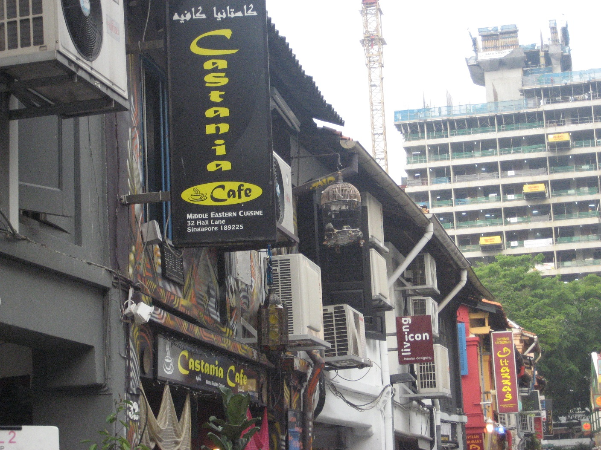

<!DOCTYPE html>
<html lang="ja">

<head>

  <meta charset="UTF-8">
  <meta name="viewport" content="width=device-width, initial-scale=1.0, maximum-scale=1.0, minimum-scale=1.0">
  <title>Portforio_practice_jquery</title>
  <link rel="stylesheet" href="vegas.min.css" />
  
 
  <link href="style111.css" rel="stylesheet">

  
   

  <link rel="stylesheet" href="css/animate.min.css" />
  

  <link rel="stylesheet" href="https://use.fontawesome.com/releases/v5.1.0/css/all.css" integrity="sha384-lKuwvrZot6UHsBSfcMvOkWwlCMgc0TaWr+30HWe3a4ltaBwTZhyTEggF5tJv8tbt" crossorigin="anonymous">
   
   <link rel="stylesheet" href="https://stackpath.bootstrapcdn.com/font-awesome/4.7.0/css/font-awesome.min.css">
   

  

</head>

<body>

  

    <header class="header">
      

      <h1><i class="fas fa-frog fa-spin"></i>週末副業社</h1>
        <nav>
          <ul>
            <li><a href="#">トップページ</a></li>
            <li><a href="#">会社概要</a></li>
            <li><a href="#">事業内容</a></li>
            <li><a href="#">採用情報</a></li>
            <li><a href="#">お問い合わせ</a></li>
          </ul>
        </nav>
      

    </header>
    

    
  

      <i class="fa fa-bars" aria-hidden="true"></i>
    

    

      
トップページ

      
会社概要

      
事業内容

      
採用情報

    

  

    

        
当ホームページにお越しいただき 
         まことにありがとうございます
	
    

  

  <h2>
    

    

      <i class="fas fa-kiwi-bird fa-2x faa-wrench "></i>海外旅行好きなサイト

    </h2>

    

    

    アクティビティ
    
    
  
    
    

   
  
    
アラブストリートには、ファッション雑貨店や飲食店がずらり。２時間もあれば回れるコンパクトなエリアです。アラビア絨毯や籐かご、ソケット帽子などのムスリムの生活必需品や、エキゾチックな香りのお土産がたくさん見つかるでしょう。MRTブギス駅から徒歩圏内なので道に迷う心配はありません。
   

   

  

@media (min-width: 360px) {

  

    ショッピング
   
   
  
    
チャイナタウン駅から直通のアーケード街がパゴダストリート。雑貨店がひしめきあうメインストリートです。古くからの老舗レストランや最新雑貨ショップまで、新旧入り混じったチャイナタウンをくまなく散策してみましょう。きっとお気に入り点が見付かるハズ？
    

  

   
  
    
   

  

}

@media (max-width: 360px) {

    

    ショッピング
    
    
  
    
    

   
  
    
チャイナタウン駅から直通のアーケード街がパゴダストリート。雑貨店がひしめきあうメインストリートです。古くからの老舗レストランや最新雑貨ショップまで、新旧入り混じったチャイナタウンをくまなく散策してみましょう。きっとお気に入り点が見付かるハズ？
    

   

  

}

  

    食べ歩き
    
   
  
    
    

   
  
    
「ハイナンチキンライス（海南鶏飯）」は、シンガポールグルメの代表格と言っても過言ではありません。鶏の脂で炒めた白米を、同じく鶏からとったスープで調理したご飯に、茹でた鶏肉が添えられたもの。あっさりとした旨味が日本人の口にもよく合います。
   

   

<!--Call your modal-->
<ul>
  <h4>コーディングツール</h4>
  <li>
    <a id="demo01" href="#animatedModal" >WORKS</a>
    </li>
</ul>

<!--DEMO01-->

  <!--THIS IS IMPORTANT! to close the modal, the class name has to match the name given on the ID -->
  
 
      CLOSE MODAL
  

 

  

      <!--Your modal content goes here-->
      
      
  

  

  お問い合わせフォーム

<form method="post" action="sample.cgi">
      <fieldset>
          
名前<input type="text" name="name1" size="10">

          
住所<input type="text" name="address1" size="30">

          
ご相談内容<input type="text" name="address1" size="100">

      </fieldset>
           
<input type="submit" value="送信">

  </form>

</body>

<footer>
  
  <!-- 背景を正方形で白抜き -->
  

  <ul class="pattern-02 square"　>
      <li >
        

          <a href="#" class="icon-wrap icon-wrap-facebook">
              <i class="fab fa-facebook fa-3x"></i>
          </a>
        

        

          <a href="#" class="icon-wrap icon-wrap-twitter">
            <i class="fab fa-twitter fa-3x"></i>
          </a>
        

        

          <a href="#" class="icon-wrap icon-wrap-line">
            <i class="fab fa-line fa-3x"></i>
          </a>
        

      </li>
<li>
</ul>

<h5>↓連絡先：下名がお客様のお手伝いをさせて頂きます</h5>

       

        
      

<h5>カレンダー</h5>
<input type="text" id="datepicker">

</footer>
</html>
